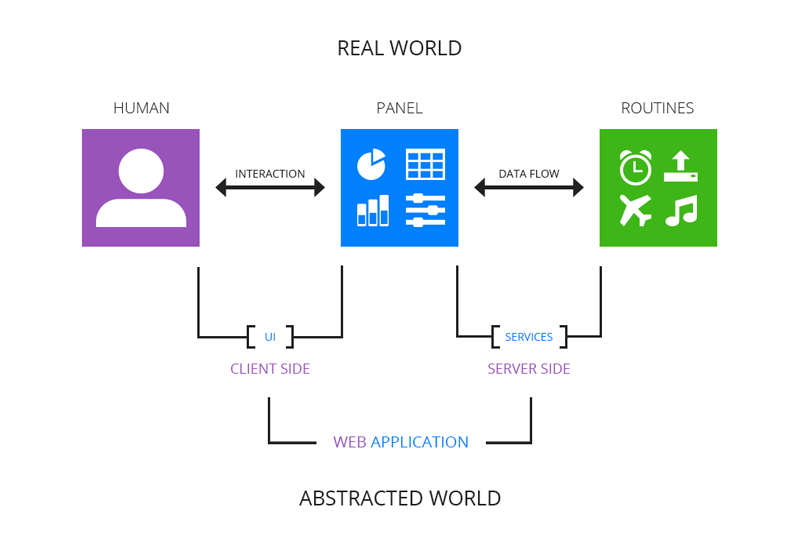

Stage.js     v1.7.2
===================
This project produces **Stage.js** - an infrastructure for building modern web application client with many contexts (e.g a data-heavy administration app). In other words, we solve this problem for you:

</img>


What's next?
------------
2.0.0 Roadmap:
* Merge Context, Regional, Widget, Editor and Canvas to be named Views with mixins;
* Use the navigation chain from start based only on named layout views with navRegions;
* Introduce State(ViewModel) into the picture. (Data, State, (View)Model/(View)Collection, View/Layout, Navigation, Widget/Editor, Events);
* Stateful navigation mech: app@state/context@state/lvl1@state/lvl2@state;
* Remove deps on Marionette.js, jQuery UI Core/Widget;
* Datagrid+ : select-all header/cell, details row;
* Editor+ : Spinner/Range, Switches, DnD Listing;
* local filter/sorter mech into list views; 
* local pagination mech into list views (in addition to the remote one we already have);

Quick Start
------------
```
npm -g install stage-devtools
mkdir project
cd project
stagejs init
stagejs serve [--port <number>]
```
You can now start developing your app with Stage.js. Read the documentation below for more.

Documentation
-------------
See [documentation](http://bluekvirus.github.io/Stage.js/#navigate/Document)

Contribute
----------
Fork/Clone the project and tweak the code locally, then contribute by making a pull request so you can push the change in.

###Prepare
After cloning the project, you should go to `/tools` and run these commands:
```
//1. prepare bower packages
//under /tools/libprep
bower update
node run all

//2. prepare default theme pack
//under /tools/themeprep
node run

//3. prepare npm packages
//under /tools
npm install

//4. fire up dev server
//under /tools
[sudo] npm start
```
This should fire-up the development server. It will serve the `/implementation` folder as web root on the port define by `/tools/devserver/profile/default`. Please go check the content of this profile config file before starting. It has some nice middlewares and auto-change-detectors there you can switch on/off to make the development a lot easier.

###Develop, Demo & Tryout
Change code under `/implementation/js/src` to test and contribute your ideas to this framework.

The `/implementation` folder is also the product intro & download page of **Stage.js** releases. You can go change the code under `/implementation/site`, it is the application for **Stage.js**'s documentation site.

Look closely to the `/implementation/index.html` file, it not only defines the loading sequence of all the src files but also defines which one goes to which build target in the build process.

###Modify theme
Please go check the `/implementation/themes/default` basic theme package and follow instructions in the `/less/main.less` over there. You can easily switch to use other base themes offered by [bootswatch](http://bootswatch.com/) (based on Bootstrap 3) to quickly build up your own.

You can always refresh existing theme or start a new one by using the theme-prep tool under `/implementation/tools/themeprep`.


Distribute
----------
###Build
```
//0. change version numbers
README.md, HOWTO.md, CHANGELOG.md and libprep/bower.json

//1. update libs through tools/libprep/
bower update
node run all

//2. [optional] update themes through tools/themeprep/
node run 
node run site

//3. build all distributions through tools/build
./shortcut.sh
```

###Deploy
See in `tools/build/dist` and `dist` for details. The shortcut command also builds the project site (as its github page).


License
-------
Copyright 2013 - 2015 Tim (Zhiyuan) Liu. 
Under the [MIT](http://opensource.org/licenses/MIT) License.

