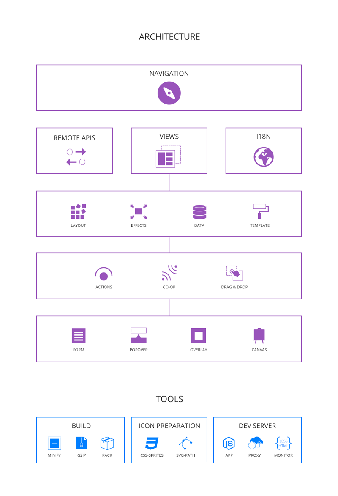
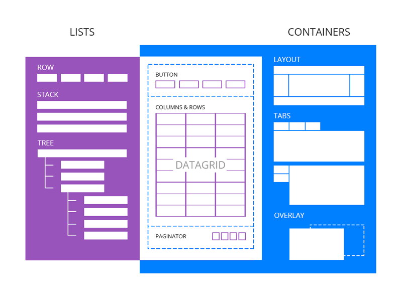

<i class="project-title"></i>
<hr/>
Building multi-context rich-client web application front-end in the modern way.
[@Tim (Zhiyuan) Liu](mailto:bluekvirus@gmail.com)


Current version
---------------
**@1.7.0**
([Why is it version-ed like this?](http://semver.org/))


Introduction
------------
This lightweight framework is made on top of **Backbone.Marionette** and **Bootstrap**. The goal is to maximize developer efficiency by introducing an intuitive workflow on top of a solid front-end architecture. You will be focusing on user interaction building without distraction. We even give you a web server to start the development right away! Theming and packaging deployments are also a breeze through our tools.

To flatten and lower the initial learning curve of adaptation, there is only a handful of APIs to remember:

Initialize:
* Application.setup (options)
* Application.run ()

Structure:
* Application.context (name, options) - alias: page()
* Application.view (options, instant)

Reuse:
* Application.widget (name, options/factory)
* Application.editor (name, options/factory)
* Application.editor.validator (name, fn) - alias: editor.rule()

Handling Data:
* Application.remote (options)
* Application.model({data}) - shortcut for new Backbone.Model(data)
* Application.collection([data]) - shortcut for new Backbone.Collection(data)

Mutual Exclusion:
* Application.lock ([topic/lock])
* Application.unlock ([topic/lock])
* Application.available ([topic/lock])
-----------------------------------------------------------------------------

**Remember:** Your goal is to
* Create view objects with HTML template and actions. 
* Put them into pre-defined layout regions. 
* Make them talk to each other through events.
* Group them into purposeful(topic related) swap-able contexts.

**Don't:**
* Create Model and Collection instances unless it is to generate views.
* Wrap/Organize your view definitions into Class hierarchies.
* Put more than 2 non-object params in any function signature.
* Use direct method invocations for view-view, view-context, view-application collaborations.

**Keep your JavaScript codes flat and HTML dynamic, style through CSS class.**


###Why not using...
Why not using AngularJS/EmberJS/Meteor or YUI/ExtJS? Yes you can, but, if you can, **always favor libraries over frameworks**. Given that *Stage.js* is also a framework. The advise here should be extended to: 
> If you can *NOT* agree with the workflow/abstraction, always favor libraries over frameworks.

We choose what we choose when designing this framework simply because we want total control over our product. There are often 2 types of framework to choose from when developing a web application:
* Development Framework - AngularJS/EmberJS/Meteor (infrastructure only)
* Application Framework (All-in-One) - YUI/ExtJS (infrastructure plus widgets and tools)

**The Backbone library can implement them all** (Yes, any client side framework). (Not 100% for Meteor though, since Meteor combines its server into a full-stack solution. You need nodejs in the picture, and we do have a dev-server package called **ajax-box-lite** in the toolset for just that based on the [express.js](http://expressjs.com/4x/) framework). And, if you need more evidence, YUI3 has the exact same concepts from Backbone implemented as its infrastructure. (Why did we mention YUI here? Because of Yahoo!'s JavaScript [Architect](http://www.crockford.com/))

In order to accomplish more with less code using Backbone, we picked Backbone.Marionette as our pattern library. It offers cleanup/boilerplate routines and very neat concepts for building large JavaScript front-end projects. The resulting framework accomplishes all the big frameworks have promised but with **a thiner and flatter structure**. We believe scripting languages are always going to be the perfect thin glue layer between mechanisms and policies. The JavaScript language were picked to glue HTML/CSS and UX but nothing more, it should not be overdosed and attempt to mimic Java. In other words, **only the burger is important**:

</img>

###Core concepts
</img>

####What's Navigation?

We achieve client-side multi-page-alike navigation through switching *Context*s on a pre-defined application region in respond to the URL hash fragment change event. You can also keep navigating beyond a *Context* by chaining view names in the hash. (e.g #navigate/Context/LvlOneSubView/LvlTwoSubView...)

By using named views and their `navRegion` properties, our navigation mechanism enables endless possibilities in combining views in hierarchies.

####What's a Context?
A *Context* is a special *Marionette.Layout* view object. *Context*s only appear on the application's context region (each application can have only 1 such region). If you have more than 1 *Context*s defined, they will automatically swap on the context region in response to the navigation event. You will not have more than 1 active *Context* at any given time.

A *Context* can also guard itself from being viewed by certain user by utilizing the `guard` property (a function) before switched to in navigation. This is good for automatically jumping to other contexts if the targeted one requires authenticated user in session. 

alias: Page

####What's a Regional?
A *Regional* is a *Marionette.xView* (*ItemView, Layout, CollectionView and CompositeView*) with name, it is to be shown on a region in template of your application or any *Marionette.Layout* instance. As you can see, since a *Context* is a *Layout* with extra functions, *Regional*s will be used closely with it. You can link a *Regional* with a *Context* by putting the *Regional*'s name in the *Context*'s template. Read more about *Regional* in the **Quick steps** section. 

**Update**: We are merging this concept with *View* in general. Future releases will not distinguish between *Regional*s and named *View*s.

alias: Area, named View

####Remote data handling?
Modern web application generates views according to user data dynamically. This is why we picked *Backbone/Marionette* as our implementation base -- to use dynamic views rendered through data. However, the way we handle remote data in our framework is a bit different than the original design in *Backbone*.

**Important:** We introduce a unified *DATA API* for handling all the in/out of remote server data, skipping the *Model/Collection* centered way of data manipulation. *Model/Collection* are only used as dumb data snapshot object on the client side to support views. The goal is to make the data interfacing layer *as thin as possible*. You will find more details in the **Quick steps** section.

####Reuse view definitions?
For *Regional*s (or any *Marionette.xView*) that you need to use again and again but with different configuration (e.g a Datagrid). Register it as a *Widget* or, in case of a basic input, an *Editor*. These reusable view definitions are call *Reusable*s in the framework. Think in terms of the **List and Container** technique as much as possible when creating them.

####Glue through events
We encourage event programming in this framework. We glue views into a functioning whole by using meta-events. Whenever an interaction or transition happens (e.g navigation, context-swap, login, error, data-ready...), instead of calling the actual *doer*s, **fire/trigger an event first and provide a default listener**, so that later the actual behavior triggered by this event can be changed without affecting the glue/interfacing logic. Read carefully through the **Events** subsection in **Quick steps** below so you understand how to implement and extend application behaviors mainly through events. 

####Application locking
Sometimes, with Ajax or other asynchronized operations (like timer related ones), you might need to disable the application's ability to navigate through views or respond to certain events/actions. We have a very neat locking module for you to use in just those situations. The 2-level locking design allows you to decide when to use the global lock or the topic based ones to maximize your control over the availability of UIs.

####Seems complicated...
To focus, think of your application in terms of *Context*s and *Regional*s (pages and areas). Like drawing a series of pictures, each page is a *Context* and you lay things out by sketching out regions (areas) first on each page then refined the details (*Regionals*). Each *Context* can also be made state-aware through the same navigation mechanism that powers *Context* switching in the application container.

Use *Model*/*Collection* wisely, try not to involve them before relating to any *Marionette.xView*. In other words, unless you want a dynamic view, do **NOT** use *Model*/*Collection*. Fetch/persist data through a unified *Data API* (CRUD in RESTful format). Focus on UI/UX and make the data interfacing/manipulation layer as thin as possible. Operate on plain data object/array only. Bind pagination, sorting and filtering operations with views instead.

Getting started
-----------
You are assumed to have programed with:

* Marionette.js 
<small class="text-muted">(Layout, Collection/CompositeView, ItemView)</small>
* Handlebars.js 
<small class="text-muted">(as template engine)</small>

and this indicates:

* jQuery or Zepto 
<small class="text-muted">(DOM manipulation through CSS selectors)</small>
* Underscore.js or Lo-Dash 
<small class="text-muted">(handy js functions)</small>
* Backbone.js 
<small class="text-muted">(Model/Collection, View, EventEmitter, Router)</small>

If you don't know what they are, go for a quick look at their websites. (links are provided under the *Included Libraries* area on the left sidebar)

We also maintain a list of 3rd party libraries for the developers to choose from in addition to the base libraries. These utility libraries (e.g jquery-file-upload, store.js, uri.js, raphael.js, marked, moment.js, socket.io.js...) are carefully selected from the many open-source JavaScript libraries out there to help with specific but generally-will-appear problems that a developer will encounter during the web application development process. (see more in the **Include other js libraries** section)

**Remember:** The goal of this framework is to assist you making better use of *Marionette* (thus *Backbone*). It is designed to keep you focused on building dynamic views without worrying about putting/linking/organizing them into a manageable whole. It is very important that you understand the 4 types of views (*ItemView, Layout, CollectionView and CompositeView*) offered by the *Marionette* pattern library. So that you can maximize the efficiency offered by our unique workflow, intuitive toolset and prepared application container.

###Choose the right distribution

####Project kit
> * /design
>   * /assets (-)
>   * /docs (-)
> * /implementation -- your web root
>   * /js (-)
>   * /static (-)
>   * /themes
>   * index.html
>   * bower.json
> * /tools
>   * /build -- minify and concatenate your js files by scanning index.html
>   * /themeprep -- prepare your theme with textures, fonts and icons
>   * /devserver -- development web server with less file monitor
>   * /shared -- shared scripts used by the tools
>   * package.json

**(-)**: This folder is empty initially, it is created as a suggestion.

Use the project-kit distribution whenever you want to start a production level web application project.

####Release pack
> * /js
>     - /lib
>         + dependencies.min.js
>         + dependencies.json
>     - stage.js
>     - stage.min.js
> * CHANGELOG.md
> * LICENSE
> * README.md

This distribution is designed to be simple and doesn't have tools and theme packages for production level development. The release-pack folder is serve-able out of the box.

Use the release-pack distribution for prototyping your next product concept, or to keep your project core up-to-date.

**Note**: The release-pack distribution is also what you will get from the bower package manager when using command:
```
bower install/update stage
```


###Quick steps
Here is the recommended **workflow**. You should follow the steps each time you want to start a new project with *Stage.js*.


####Preparation
#####Automatically
1. Install the `stage-devtools` from `npm`:
```
npm -g install stage-devtools
```
2. Under an empty folder run:
```
stagejs init
```
3. [optional] Update everything with the latest edge version:
```
stagejs update --edge --packages
```
4. Start the development server
```
stagejs serve [--port <number>]
```
Read more about the dev tool [here](https://github.com/bluekvirus/Stage-devtools).

#####Manually
Download the *Stage.js* [project-kit](static/resource/default/download/stagejs-starter-kit.tar.gz) and extract its content to your project folder of choice.

Under your project folder, open up a console/terminal on your OS and do the following:
1. Under the `/tools` folder run
```
npm install
npm start //this will start the development web server
```
2. Under the `/implementation` folder run
```
bower install
```
3. Under the '/tools/themeprep' folder run
```
node run [your theme name] //leave blank if you are using theme 'default'
```
**Note**: It is recommended that you use the theme preparation tool to create a new theme before you continue to develop your project. This way, whenever the basic (default) theme updates, you can upgrade to it easily.

4. Create a `main.js` (you are free to choose whatever the name you like) 
and include it in `index.html` below the `<!--main.js-->` comment line:
```
<script src="bower_components/stage/dist/js/lib/dependencies.min.js"></script>
<script src="bower_components/stage/dist/js/stage.min.js"></script>
...  
<!--main.js-->
<script type="text/javascript" src="js/main.js"></script>
...
```
**Note:** You can use `stage.js` instead of `stage.min.js` to have better debugging info.
Minimum `main.js` script looks like this:
```
//main.js
Application.setup().run();
```
You should now see a *blank* page without JavaScript error on http://localhost:5000/dev/.

If you are really in a hurry to see some stuff on page, give your application a template:
```
//main.js
Application.setup({
    template: [
        '<div>',
            '<h1>Hello World</h1>',
            //put some html here as strings
        '</div>'
    ]
}).run();
```
**Tip:** Instead of configure a template in the `Application`, you can put your application's main template under a HTML tag with attribute `region="app"` in your `index.html`.

Remember, creating a web application is like drawing a picture. Start by laying things out and gradually refine the details. In our case, always start by defining the application template.

Now, let's start building a real web application.

####Step 1. Initialize

#####Configure
Go to your `main.js` and setup the application by using `Application.setup()`:
``` 
//main.js
Application.setup({
    theme: //your theme name,
    fullScreen: //false | true,
    template: //'#id', '@**/*.html', [html string array] or 'html string',
    contextRegion/navRegion: //your navRegion name marked in template,
    defaultContext: //your default context name to show in navRegion,
    baseAjaxURI: //your base url for using with Application.remote(),
    viewTemplates: //remote view templates folder, if using template:@**/*.html in views,
    i18nResources: //where to load i18n related data (e.g translations),
    i18nTransFile: //the translation file name/pattern under i18nResources
}).run();
```
The configure variables have sensible defaults, you can safely skip configuring them here, however, there is one you might want to change now -- `template`.

You can re-configure the `baseAjaxURI` and `viewTemplates` later by invoking the `Application.setup()` method again:
```
//main-type-desktop.js
Application.setup({
    viewTemplates: 'static/template/desktop'
}).run();

//main-type-mobile.js
Application.setup({
    viewTemplates: 'static/template/mobile'
});
```

Since your goal is to build a *multi-context* application, you will need some *regions* in the application template and a *Context Region*:
```javascript
//main.js
Application.setup({
    ...
    template: [
        '<div region="banner" view="Banner"></div>',
        '<div region="body"></div>',
        '<div region="footer"></div>'
    ],
    contextRegion: 'body', //use region 'body' as the context region
    ...
}).run();
```
A `region=""` attribute on any html tag marks a pre-defined region in the template, **you can also do this with any *Marionette.Layout*** in our framework. Doing so is equivalent of using the `regions:{}` property.

Tag marked with `region=""` can use an additional `view=""` attribute to load up a *Regional* view by name:
```
'<div region="banner" view="Banner"></div>'
//is equivalent to
onShow: function(){
    this.getRegion('banner').trigger('region:load-view', 'Banner');
    //or
    this.getRegion('banner').show(new Application.Core.Regional.get('Banner'));
}
```
**Note:** *Regional* views loaded by the `view=""` attribute should have no init options. If you do need to specify init options when showing a *Regional* view, use the alternatives.

If your application is a single-context application, you don't need to assign the application template. There will always be a region that wraps the whole application -- the *app* region. The **Default** *Context* will automatically show on region *app* if you did not specify `contextRegion` and `defaultContext`.

#####Start up
```
Application.setup({...}).run();
```

**Tip:** If you are using Stage.js in a hybrid app (cordova/phonegap), use this to kickstart the app:
```
Application.setup({...}).run(true);

//or

Application.setup({...}).run('deviceready'); //hook on specified ready event
```
Note that the ready event may vary in different hybrid app development package.

#####Customized bootstrapping
The application bootstrapping sequence can be modified, since we are simply using the Marionette.Application object, you can add your own environment preparation code in one of the 4 ways that Marionette offers:
```
//0. "initialize:before" / onInitializeBefore:
// - fired (on Application) just before the initializers kick off

//1. add more initializers
Application.addInitializer(function(options){...});

//2. "initialize:after" / onInitializeAfter: 
// - fires (on Application) just after the initializers have finished

//3. "start" / onStart: 
// - fires (on Application) after all initializers and after the initializer events

Application.setup({...}).run();
```

Plus the events we put in during application loading:
```
app:before-template-ready //fired before the application template is shown
app:template-ready //fired after the application template is shown
```
Note that only after the `app:template-ready` event, can the application start its initializer-calling sequence. In other words, if you've added customized initializers, they will be called after the `app:template-ready` event.

**Tip**: You can swap application template using the `Application.setup()` call upon receiving the `app:before-template-ready` event to layout your application differently on different platforms. (Use the `Modernizr` global variable for platform/feature detections.)

You can also make good use of the `app:navigate` event and the `app:context-switched` event for per-context preparation.

Let's proceed to define your contexts so you have something to show after the application starts.

####Step 2. Define Contexts
Create a new file named `myContextA.js`, remember a *Context* is just an special *Marionette.Layout* view object, all you need to do is adding a name to the ordinary *Marionette.Layout* options:
```
//myContextA.js
(function(app) {
    app.context('MyContextA', { //omitting the name indicates context:Default
        template: '...',
        //..., normal Marionette.Layout options
        onNavigateAway: function(){
            //... 
            //if you want to save context status (through localStorage maybe)
        }
    });
})(Application);
```
alias: `Application.page()`. 

**Tip:** When defining template for a context you can use one of the four ways we support:

* \#id -- local html template by DOM id;
* @\*\*/\*.html -- remote html templates;
* 'html string' -- single line html string;
* ['html str1', 'html str2', ...] -- array of html strings;

**Note:** To enable remote template support, you need to configure `viewTemplates` through `Application.setup()`.

**Note:** Remote view templates will only be fetched once and then cached and reused within the client side application. Additional view instances using the same remote template will not trigger another loading process.

**Note:** Remote templates should be combined into a single `all.json` file before going into production deployment. This is already supported by our build tool. Check your build configure file to enable this auto processing. You don *NOT* need to care about this `all.json` file. It is automatically loaded once you've set the `viewTemplates` configure.

**Tip:** Combine remote templating with IDE tool (ZenCoding/(Emmet)[http://emmet.io]) will greatly improve your development speed.


#####Navigate between Contexts
Use the `app:navigate` event on `Application` to actively switch between contexts.
```
//full path mode
Application.trigger('app:navigate', 'ABC/EFG/...');

//context, module/subpath mode
Application.trigger({
    context: 'ABC',
    subpath: 'EFG/...', //alias: module
});
```
You can also use the clicking event on an `<a>` anchor tag to switch context without any code involved:
```
<a href="#navigate/ABC/EFG/..."></a>
```
Or, brutally using the actual `window.location` object:
```
window.location.hash = '#navigate/ABC/EFG/...';
```

There is an `context:navigate-away` event triggered to call `onNavigateAway` method on a context when the application is switching away from one. Use this listener if you want to store some of the context state and recover later. We recommend that you use the localStorage feature of HTML5 and we have already include a library for you in the framework distribution. (see [store.js](https://github.com/marcuswestin/store.js) for more)

**Note**: You can pass an additional *silent* argument with the `app:navigate` event to avoid changing the url hash path during the navigation:
```
Application.trigger('app:navigate', {
    context: context, //optional
    subpath: subpath //omitting context will append subpath to current context
}, true);
//or
Application.trigger('app:navigate', 'path string...', true);
```

If you defined a `guard` function as property in one of your contexts, it will be called before the context gets switched to. If the `guard` function returns an error, `app:context-guard-error` will get triggered on the `Application` object with the returned error and context name. You can use this mechanism to guard your contexts from unauthenticated users and automatically jump to a pre-defined login context. 
```
(function(app){

    app.context('AccessDenied', {
        template: '...',
        guard: function(){
            
            //block access
            return {
                msg: 'You are not allowed to see this context',
                target: this
            };

            //or to signal passing of this guard simply return nothing
            return;
        }
    });

    //the default guard error listener for Application
    app.onContextGuardError = function(error, ctxName){
        console.error('DEV:Context-Guard-Error:', ctxName, error);
    };

})(Application);
```

#####Navigate beyond a Context
When the navigation is at `#navigate/MyContextA/SubViewA/SubViewB...` the router finds `navRegion` in `MyContextA` and shows `SubViewA` in it and then move on to `SubViewA` to show `SubViewB...` in its `navRegion`. If, somehow, it can not find the definition of `SubViewA`, the navigation stops on `MyContextA` and triggers `view:navigateTo` event with the remaining subpath starting with `SubViewA/...` on `MyContextA`. The same process happens on `SubViewA` if the router can not find `SubViewB...`.

**Tip**: Use `onNavigationEnd` callback to recover the default content of a context or named layout if you need. The `view:navigation-end` event will be triggered on the context or named layout (in addition to `show`) if it is the last one on the navigation path. 

**Note**: *Context*s, *Regional*s (named views) of type `Layout` are all named *Layout*s, they can all appear in the navigation path if they have the `navRegion` property defined.

You will learn how to create *Regional*s in the next section.


####Step 3. Regionals & Views
Before creating a *Regional*, change your `myContextA.js` into `/context-a/index.js` so you can start adding regional definitions into the context folder as separate code files. Always maintain a clear code hierarchy through file structures. (Try to limit each code file to be **under 300-400 lines** including comments)

Create `/context-a/myRegionalA.js` like this:
```
//myRegionalA.js
(function(app) {
    app.regional('MyRegionalA', { //omitting the name gets you an instance of this definition.
        type: 'CollectionView', //omitting this indicates 'Layout'
        template: '...',
        //..., normal Marionette.xView options
    });
})(Application);
```
alias: `Application.area()`. 
alias: `Application.view({name: '...', ...})`.

By default, `Application.regional(['you regional view name',] {...})` returns the **definition** of the view, if you want to use the returned view **anonymously**, remove the `name` argument. You will get an **instance** of the view definition to `show()` on a region right away. 

Sometimes your *Regional* is comprised of other sub-regional views and that's fine, you can nest *Regional*s with the `region=""` and `view=""` attributes in the template (only if it is of `type: Layout`). 

There will also be time when you just need plain *Marionette.xView* definitions to be used as item views within *Regional*s. After all, *Regionals* are just *named* views for reuse and faster loading on regions.

You can define non-regional (un-named) views through the `Application.view()` API:
```
//myRegionalA.js
(function(app) {
    app.regional('MyRegionalA', { //omitting the name gets you an instance of this definition.
        type: 'CollectionView', //omitting this indicates 'Layout'
        template: '...',
        itemView: CustomView,
        //..., normal Marionette.xView options
    });

    var CustomView = app.view({
        type: '...', //ItemView, Layout, CollectionView or CompositeView
        ..., //rest of normal Marionette.xView options
    });     
})(Application);
```
The above call to `app.view()` returns a **definition**. If you want an **instance** to be returned, do it like this:
```
...
var view = app.view({...}, true);
...
```

**Tip:** Remember, when defining template for a regional/view you can use one of the four ways we support: \#id, @\*\*/\*.html, 'html string' and ['html string' array].

**Important:** If preferred, you can always give your view a name for it to be registered as regionals, this is another short-cut we create in an attempt towards removing the *Regional* concept in future releases.
```
...
var regional = app.view({name: '...'});
...

//for a view to be used in the navigation chain
var regional = app.view({
    name: '...',
    type: 'Layout',
    template: '...',
    navRegion: '...' //dont forget this
});
//the same as above
var regional = app.regional('...', {
    template: '...',
    navRegion: '...' //dont forget this
});

```

Now, we've sketched the layout of our application, you might want more contexts defined before continue but that's the easy part, just repeat Step 1-2 till you are ready to proceed to light-up the views dynamically with remote data.

####Step 4. Handle data
Though we do not agree with *Backbone*'s way of loading and persisting data through *Model/Collection*s. We do agree that **data** should be the central part of every computer program. In our case, the remote data from server are still used to power the dynamic views. We use *Backbone.Model/Collection* only when there is a *View*. In other words, *data* and *View*s are centric in our framework paradigm, *Model/Collection*s are not. Try to think of them as a integrated part of *View*s. 

**Note:** Use normal `$.ajax()` calls for **NON-API** resources such as static `.json` files. You don't want to pick up `Application.config.baseAjaxURI` in these situations. Further, you should specify `dataType: 'json'` in your `$.ajax()` call configure explicitly for loading `*.json` files so that the data can be returned as expected locally on mobile platforms. (When there isn't a web server, `$.ajax()` get `*.json` files into text strings instead of parsed Javascript object due to incorrect MIME type.)

Our recommended way of loading/persisting remote data is through:
```
//returns the $.ajax() object - jqXHR for using promises.
Application.remote('...' or {
    entity: '',//entity name of resource
    params/querys: {...}, //converts to request parameters in header e.g ?a=1&b=2
    _id: '',
    _method: '',
    payload: {...}, //data to send to the server
    ..., //normal $.ajax options without (type, data, processData, contentType)
});
```
This method will intelligently guess which of the four HTTP method to use for each request according to the options passed. Here is some examples:
```
//GET: /abc
Application.remote('/abc');

//GET: /abc?x=1&y=2
Application.remote({
    url: '/abc',
    params/querys: {
        x: 1,
        y: 2
    }
});

//GET: /user/1/details
Application.remote({
    entity: 'user',
    _id: 1,
    _method: 'details'
});

//POST: /user
Application.remote({
    entity: 'user',
    payload: {...} //without _id
});

//PUT: /user/1
Application.remote({
    entity: 'user',
    payload: { _id: 1, ...} //non-empty + _id
});

//DELETE: /user/1
Application.remote({
    entity: 'user',
    payload: { _id: 1 } //just _id
});

```
It is recommended to handle the callbacks through promises on the returned jqXHR object:
```
Application.remote(...)
    .done(function(){...})
    .fail(function(){...})
    .always(...);
```
Render remote data in a view without mentioning *Model/Collection* like this:
```
//myRegionalA.js
(function(app) {
    app.regional('MyRegionalA', {
        template: '...',
        onShow: function(){
            //load data and render through it:
            var that = this;
            app.remote({...}).done(function(data){
                that.trigger('view:render-data', data);
            });
        }
    });
})(Application);
```
By using an event `view:render-data`, we eliminate the need of handling data rendering through *Model/Collection* in a view. Override `onRenderData()` if you want the data rendering process to be different. 

Data returned should be in the [JSON](http://json.org/) format and with `Content-Type: application/json` in its response headers. An JSON Array will be converted into a *Collection* (Object into a *Model*) before given to the view. You can trigger `view:render-data` whenever you want to change the underlying model and collection in a view instance. The `reset`, `change`, `add` and `remove` events are listened by the view and it will re-render accordingly.

**Note:** If you use `view:render-data` and pass in an `Array`, it will **reset** the collection of that view. 

Modify (paginate/filter/sort) the data before passing to the `view:render-data` event. *Do NOT* bind pagination/filtering/sorting operations with model/collection instances.


####Step 5. Adding UX
UX stands for user experience, it is not just about look'n'feel and clickings but also transitions/animations that links between interactions and state change. UX is hard to design, without a clear think-through over the purposes and targeted user tasks, it can be a total chaos... Make sure you have had your plan/sketch reviewed by targeted audience/friends or colleagues before implementation. Employ the *Goal-Directed Design* technique as much as you can.

To implement your design is, however, very easy. We have enhanced *Marionette.View* thus its sub-classes (*ItemView, Layout, CollectionView and CompositeView*) with opt-in abilities, you can use them while adding user interactions and view transitions to the application.

#####Effect
Any *Marionette.xView* can have an `effect` configure to control the effect through which it will be shown on a region:
```
//myRegionalA.js or any Marionette.xView
(function(app) {
    app.regional('MyRegionalA', {
        ...,
        effect: 'string' or
        {
            name: ..., //name of the effect in jQueryUI.Effect
            options: ..., //effect specific options
            duration: ...
        },
        ...
    });
})(Application);
```
Pass just an effect name as a string to the configure if you don't need more tweak on the effect options. For more information regarding the effect options, please go to [jQuery.Effect](http://jqueryui.com/effect/).

#####Actions
Actions are click-ables marked by `action=""` attribute in your view template. The original way of registering events and listeners introduced by *Backbone.View* are flexible but tedious and repetitive. We offer you the *Action Tags for speeding things up.

Any *Marionette.xView* can have its actions configure block activated like this (2 easy steps):
```
//myRegionalA.js or any Marionette.xView
(function(app) {
    app.regional('MyRegionalA', {
        ...,
        template: [
            '<div>',
                '<span class="btn" action="opA" lock="oplock">Do it!</span>', //1. mark action tag(s).
                ...,
            '</div>',
        ],
        ...,
        actions: { //2. implement the action listeners.
            _bubble: false | true, //bubble un-matched click event up. [default: false]
            'opA': function($triggerTag, e, lock){
                //do something here...
                ...
                app.unlock(lock); //lock = "oplock"
            },
            'opB': ...
        }
    });
})(Application);
```
Note that only 'single-click' actions can be registered like this at the moment. As you can see from the example, optionally, you can lock the action tags with topic based application locks through the `lock="..."` attribute.

Use `_bubble: true` if you want the click event to **propagate** to the parent view/container. `e.preventDefault()` needs to be specified in the action listeners if you don't want a clicking on `<a href="#xyz" action="another"></a>` tag to affect the navigation.

If you have locked the application with `Application.lock()` then the actions will not respond until the application becomes available again. This constrain is stronger than topic based locking throught the `lock="your lock name"` attribute on action tags.

**Heads up**: Don't forget to unlock your lock, if specified through the `lock="..."` attribute, at the bottom of your action listener. 

**Tip**: You can use `lock="*"` to lock the application globally.

#####Events
Some interactions demand **collaboration** between view objects, this is why we introduce the concept of meta-event programming. It is like coding through just interfaces in a object-oriented programming language but much more flexible. The goal is to let the developer code with events instead of APIs so the implementation can be delayed as much as possible. The underlying principle is very simple:
```
//event format : namespace:worda-wordb-...
object.trigger('object:meta-event', arguments);
//will invoke listener : onWordaWordb...
object.onMetaEvent(arguments);
```
We have `Application (app:)`, `Context (context:)` and all the `Marionette.xView (view:)` enhanced to accept meta-event triggers. Some of the events are already listened/triggered for you:

**Application** -- app:meta-event
```
//bootstraping
app:before-template-ready //fired before the application template is shown
app:template-ready //fired after the application template is shown
//navigation
app:navigate (string) or ({context:..., module:...}, silent) - Application.onNavigate [pre-defined]
app:context-guard-error (error, contextName) - [pre-defined]
app:context-switched (contextName)  - [empty stub]
//the followings are triggered by Application.remote():
app:ajax - Application.onAjax [pre-defined]
app:ajax-start - Application.onAjaxStart [pre-defined]
app:ajax-stop - Application.onAjaxStop [pre-defined]
//triggered by window
app:resized - [empty stub]
app:scroll - [empty stub]
//global - for alerts and prompts
app:success - [empty stub]
app:error - [empty stub]
//lock related
app:blocked - [empty stub] (action/options, lock/(n/a))
```
**Context** -- context:meta-event
```
context:navigate-away - [empty stub] - triggered before app:navigate
```
**Marionette.xView** -- view:meta-event
```
//General
view:render-data (data) - onRenderData [pre-defined]
view:data-rendered

//Layout with navRegion only
view:navigate-to
view:navigation-end

//ItemView only (SVG)
view:fit-paper
view:paper-resized
view:paper-ready

//CollectionView only (Remote Data Pagination)
view:load-page
view:page-changed
```

Remember, you can always trigger a customized event `my-event-xyz` and implement it later on the object by creating `onMyEventXyz()`.

Though you can not yet use customized meta-event on Marionette.Regions, there is a  convenient one for you:
```
//region:load-view
anyregion.trigger('region:load-view', name[, options]);
```
The `region:load-view` event listener is implemented for you and can search through both the *Regional* and *Widget* registry to find the view by name and show it on the region. You can pass in addition factory options to the event trigger. 

Recall that you can use `view=""` in a template to link a *Regional* to a region to show as well, but it will *NOT* search through the *Widget* registry for finding the view definition, due to the difficulties of putting widget options into the `view=""` marked tags.


######Use parentCt?
Before you move on, there is one more thing in this event section we want to clarify. If you use `region=""` in your template to define regions in a *Context*/*Marionette.Layout*, your sub-view instances within those regions will receive a `parentCt` property upon showing which should help you find its parent container view instance (the layout instance).

This is helpful when you want to achieve **collaborations** between sub-views by using event managed by the layout.
```
//Good
subViewA {
	...
	parentCt.trigger('co-op', data);
	...
}
parentCt.onCoOp:
	subViewB = new SubViewB(data);
	regionB.show(subViewB);
	//or
	subViewB.trigger('co-op', data);

//Bad
subViewA.parentCt.regionB.show(subViewB);
subViewA {
	...
	subViewB.doCoOp(data)
	...
}
```
**Remember:** Always prefer *Events* over *APIs* while implementing collaborations.

#####Locks
You can use a global lock to lock all UIs of your application, like this
```
//global lock
var successful = Application.lock(); 
Application.available(); //false
Application.unlock();
Application.available(); //true

//global lock 
var successful = Application.lock('*');
Application.available('*'); //false 
Application.unlock('*');
Application.available('*'); //true
```
Global lock will also disable your navigation.

Alternatively, you can choose to use topic based locking like we've introduced in the **Actions** section previously:
```
//topic based lock
var successful = Application.lock('topic'); 
Application.available('topic'); //false
Application.unlock('topic');
Application.available('topic'); //true

Application.available('anything'); //true
Application.lock();
Application.lock('anything'); //false, since global lock is unavailable.
Application.available('anything'); //false, since global lock is unavailable.
```
You can't acquire topic locks if the global lock is currently unavailable.

#####Graphs
We support graphs through SVG. A basic SVG library is integrated with the framework (Raphaël.js). You can use it in any *Marionette.xView* through:
```
Application.view({
    svg: true,
    onShow: function(){
        if(this.paper) 
            //draw...
        else 
            this.onPaperReady = function(paper){
                //draw...
            }
    }
});
```
Don't worry about the resizing routine, it is already prepared for you. The paper size will be set correctly to the container's through the use of `view:fit-paper` event on the container view object and there is an follow-up meta event `view:paper-resized` triggered on the view so you can do something accordingly after the SVG canvas is resized.
```
view.listenTo(app, 'app:resized', function(){
    this.trigger('view:fit-paper')
});
view.onPaperResized(){
    //draw...
}
```

If you require charts to be drawn, look through our monitored libraries under `/bower_components` there should be **d3.js** and **highcharts.js** for exactly that.

**Note:** HTML5 *Canvas* libraries will be added in the future.


Inputs/Editors
--------------
We have already prepared the basic html editors for you in the framework. You don't have to code `<input>`, `<select>` or `<textarea>` in any of your view template. It is now very easy to build views to function as forms or to just add inputs to views. 

You can also easily compose compound editors and fieldsets with the basic editors. This way you can reduce/combine values produced by the editors and collect them with a hierarchy/structure.

###Basic
You can activate basic editors in any *Marionette.xView* like this:
```
Application.view({
    ...,
    editors: { //editors per fieldname
        _global: {...}, //globally shared per editor configures

        abc: {
            type: 'text', //other types are available as well.
            label: 'Abc',
            help: 'This is abc',
            tooltip: 'Hey Abc here!',
            placeholder: 'abc...',
            value: 'default',
            validate: { //validators are executed in sequence:
                required: { //named validator
                    msg: 'Hey input something!', //options for the validator function
                    ...,
                },
                fn: function(val, parentCt){ //anonymous validator
                    if(!_.string.startsWith(val, 'A')) return 'You must start with an A';
                }
            }

        },
        ..., //other editor configures
    },
    ...
});
```
The editors will be appended inside the calling view instance one by one by default, or, by the `editor="[fieldname]"` position attribute in the view's template. They can also be placed according to its own `appendTo` configuration.


####Configure 
* appendTo - in case you don't have `editor="[fieldname]"` in your template and want to change where to put the editor other than the default position.
* parentCt - in case you want to delegate editor events to a parent container object (e.g a form object).
* type - text, password, url, email, checkbox(es), radios, file, hidden, ro (for read-only), textarea, select
* label
* help
* tooltip
* placeholder
* value - (default value)
* validate - (custom function or list of validators/rules)

####Advanced configure
* layout 
 - label - css class (e.g col-sm-2)
 - field - css class (e.g col-sm-10)
* html: - indicating read-only text field (setting this will cause 'type' to be 'ro')
* options: (radios/selects/checkboxes only)
    * inline: true|false 
    * data: [] or {group:[], group2:[]} - (groups are for select only)
    * labelField
    * valueField
    * remote: app.remote() config for loading options.data remotely
* multiple - true|false (select only)
* rows - number (textarea only) 
* boxLabel: (single checkbox label other than field label.)
* checked: '...' - (checked value, single checkbox only)
* unchecked: '...' - (unchecked value, single checkbox only)
* upload:
    *  standalone: false/true - whether or not to display a stand-alone upload button for this field.
    *  formData: - an {} or function to return additional data to be submitted together with the file.
    *  url - a string indicating where to upload the file to.
    *  ...  see complete option listing on [https://github.com/blueimp/jQuery-File-Upload/wiki/Options].
    *  callbacks:
        *      done/fail/always/progress ... - see complete callback listing on [https://github.com/blueimp/jQuery-File-Upload/wiki/Options].

Remember, you can always layout your editors in a *Marionette.xView* through the `editor=""` attribute in the template: 
```
template: [
    '<div editor="abc"></div>', //use fieldname to identify editor
    '<div editor="efg"></div>'
]
```

####API and events
You will also get the following APIs attached to the **view** instance object once you have configured the `editors:{}` block:
```
this.getEditor(name); 
this.getValues(); 
this.setValues(vals, loud); 
this.validate(true|false); //true for showing the validation errors.
this.status(status, messages); //for highlighting status per editor. no arguments means to clear.
```

There are also events emitted that you can use when dealing with each of these editors:
```
editor:change
editor:keyup
editor:focusin // - focus
editor:focusout // - blur
```
If you use `options.parentCt` to pass in another view instance, the events will be fired on that view instance **in addition to** firing on the editor itself. It is useful when you want every event to be fired on a parent container or, say, a form view.

Each editor instance will have the following methods:
```
editor.getVal();
editor.setVal(val, loud);
editor.disable([flag]); //false to enable, default to disable, true to disable + hide.
editor.isEnabled();
editor.validate(showError); //if you have options.validator configured
editor.status(status, message); //info, error, warning, success status, empty to reset status.

//in addition, the file editor have a .upload() method
editor.upload({
    url: ...,
    formData: {...}
});
//you can use this to trigger the upload process and submit additional data
```

**Note:** The *select, radios and checkboxes* editors can be initialized without `options.data` configuration, these editors have an additional `setChoices()` API that you can use to set the available choices later. However it is recommended that you use the `options.remote` configure if the options data is from a remote data source.

####Add your own
If you need more editors please register them through
```
Application.editor('[your editor name]', function(){
    var Editor = Application.view({...});
    ...;
    return Editor;
});
```
You need to provide the `getVal`, `setVal`, `validate`, `status` and `disable` (+`isEnabled`) methods.

**Important:** Do *NOT* use `onShow()` in your editor definition. Use `onRender` instead so that your editor can support the `editor=""` template attributes for dynamic positioning.

There is also another way of activating your editors without fixing the configurations in the view definition:
```
Application.view({
...
    onShow: function(){
        this.activateEditors(options);
    },
...
});
```
**Warning:** Although this is no difference than defining a view dynamically with editors configuration, it is not the *recommended* way of adding editors to a view.

####Validation
A custom validate function for an editor can be directly configured like this:
```
var Demo = app.view({

    editors: {
        ...,
        xyz: {
            type: '...',
            help: '...',
            validate: function(val, parentCt){ //parentCt points to this view
                if(val !== '123') return 'You must enter 123';
            }
        },
        ...
    }

});
```

You can also specify multiple validators and rules to use on the same editor:
```
var Demo = app.view({

    editors: {
        ...,
        xyz: {
            type: '...',
            help: '...',
            validate: {
                ruleA: {
                    //options to predefined rule A
                },

                ruleB: {
                    //...
                },

                fn1: function(val, parentCt){ //anonymous validator
                    //...
                },

                fn2: function(val, parentCt) {
                    //...
                },

                ...// more validators

            }
        },
        ...
    }

});
```

The validate function or validators should return **undefined or the 'error string'** to indicate passed and rejected situation respectively.

You can always register more named validators as rules by:
```
Application.editor.validator('my-validator-name', function(options, val, parentCt){
    ...,
});
```
alias: `Application.editor.rule()`.

###Compound
Sometimes you need to build a compound editor with more basic editors than the number of values collected. You can do this by assigning a view **definition** to the editor configure:
```
Application.view({

    editors: {
        a: ...,
        b: ...,

        c: Application.view({
            template: ...,
            editors: ..., //*required
            getVal: ..., //*required
            setVal: ..., //*required
            status: ... //*required if you want customized error message display.
        })
    }

});
```
This has some disadvantages compare to registering an new editor via `app.editor()`, but is more intuitive when defining a compound form editor.

If you still want `_global` (e.g appendTo) configure and `parentCt` (for editor events) to be passed to the editor, use `app.editor()` to register the view as a formal editor.

**Note**: Compound editor has its child editors' eager validation feature disabled.

**Tip**: Configure your child editor without the `label` config option.


###Fieldset
With view instance easily turned into form now, you might want to nest form pieces with *Marionette.Layout* and *Marionette.ItemView* and collect the values with similar hierarchy, this could be done by adding a `fieldset` property to your view definition besides the `editors` configuration:
```
var FieldsetX = Application.view({

    fieldset: 'sub-fieldset-x',
    editors: {
        ...
    }

});
```
Then, you can use the view as normal regional views in a layout:
```
Application.view({

    type: 'Layout',
    template: [
        '<div region="fieldset-a"></div>',
        '<div></div>'
    ],
    editors: {
        ..., //the layout can itself contain editors!
    },
    onShow: function(){
        this.getRegion('fieldset-a').show(new FieldsetX);
    }

})
```
Now, the values you collect from the layout through `getValues()` will contain a field `sub-fieldset-x` with all the values collected from that fieldset view.

You can also control the nested editors through a dotted name path:
```
layout.getEditor('sub-fieldset-x.abc'); //will get you editor `abc` in targeted fieldset.
```

**Note**: Normally, if you don't need to collect values per group, you can omit the `fieldset` property in the view's definition. Values will be merged with those from the parent layout view.

###Build a form
As you can see from the above sections, you can build 2 types of forms through views:
* Basic/Piece
    * Just use the `editors:{}` configure block in a view definition.
* Nested
    * Use a layout view together with nested views into regions.
    * Name nested views with fieldset names to form a hierarchy if needs be.

In a nested form view, may there be fieldsets or not, you can always use these APIs in the outer-most layout:
```
this.getValues(); 
this.setValues(vals, loud); 
this.validate(true|false); //true for showing the validation errors.
```
The above APIs will automatically go through the regional views as well, if they too have the same functions attached. This enables a way to progressively build a form view through layout and regions and then still be used as a whole. 


Widgets
-------
To make your view definitions reusable, we offer a way of registering *Widget*s:
```
//Widget name can be used in region:load-view meta event trigger
Application.widget('MyWidgetName', 
	function(){
		var UI = Application.view({...});
        ...;
		return UI;
	}
)
```
It is recommended to employ the **List'n'Container** technique when creating *Widget*s.

Note that you will need some sub-views to help compose the *Widget*, use the short-cut we provide to define them for better extensibility in the future:
```
var MyItemView = Application.view({
	type: '', //default is ItemView, can also be Layout, CollectionView and CompositeView.
	..., //normal Marionette.xView options.
});
```

To instantiate a *Widget*, use either `region.trigger('region:load-view', name, options)` or:
```
Application.widget('MyWidgetName', {
	..., //rest of the init options, don't pass in a config named 'factory'. 
})
```


###Build your own
The *List'n'Container* technique is the golden technique to use when planning your reusable views or, say, any view on screen. Any widget on screen can be decoupled into lists and containers, like this:

</img>

* Starts by choosing a proper container with desired layout, nest containers if needs be.
* Put lists into the container.
* Figure out the view to show within each list item.

You can always nest another layer of container-list-item into an item of parent layer to form even more complex views. Make sure you use the `Application.view(options)` API when defining the list item views.

**Important**: *Do NOT* use `Application.regional()` in widget building.

**Suggestions**: 
* Always implement the `view:reconfigure` meta event listeners in a widget for swapping data and configuration after the widget is shown. Make sure the `view:render-data` event is working as expected as well. 
* Keep widgets reconfigurable in display and dumb in functionality, don't put *policy* code as logic into them. 
* Leave space to accommodate real case usages by keeping options minimum. Don't turn into an *all-in-one* thing and force other developers to *configure* the widget.
* Fire event whenever an action is triggered, provide a default listener so that later it can be rewired.
* Test your widget in designed scenarios thoroughly with mock-up data.

To assist you further in the development process, we have several pre-implemented lightweight widgets bundled into the release as well, let's examine them. 


###Datagrid
**Purpose**: Give you a dynamic `<table>` with columns and customizable cells.

**Options**:
```
data: [{key: val, key2: val2, ...}, {}] - //array of data objects
columns: 
[
    {
        name: //a key string in the data object
        header: //default: 'string' (e.g 'string' maps to 'StringHeaderCell')
        cell: //default: same as header (e.g 'string' maps to 'StringCell')
        label: //name given to header cell, default: _.titleize(name)
    },
    ...
]
```

**Usage**: 3 possible scenarios
```
...
//Scenario 1. configured
this.region.trigger('region:load-view', 'Datagrid', {
    className: 'table table-hover',

    data: Mock.mock(mockDataTpl).data, //optional, you can put data into the grid later.
    columns: [
        {
            name: '_id',
            label: '#',
            cell: 'seq'
        },
        {
            name: 'username',
            icon: 'fa fa-envelope'
        },
        {
            name: 'profile.name',
            label: 'Name'
        },
        {
            name: 'profile.age',
            label: 'Age'
        },
        {
            name: 'link'
        },
        {
            cell: 'action',
            //label: 'Ops',
            icon: 'fa fa-cog',
            actions: {
                edit: {
                    //action listeners are bound to the row
                    fn: function(){
                        //record, columns
                        console.log(this.model, this.collection);
                    }
                }
            }
        }
    ]
...

//Scenario 2. feed data into the grid after it is shown:
var datagrid = this.region.currentView;
datagrid.trigger('view:render-data', [...data...]);

//Scenario 3. re-configure the columns and cells:
datagrid.trigger('view:reconfigure', {...new config options...});
});
```

**Operate on a row**
```
var table = new Datagrid();
table.on('row:clicked', function(row){...});
table.on('row:dblclicked', function(row){...});

or
otherView.listenTo(table, 'row:clicked', function(row){...});
otherView.listenTo(table, 'row:dblclicked', function(row){...});
```

**Extend columns**:
```
;(function(app){

//make a new cell: -- cell: string,
    app.widget('StringCell', function(){

        var UI = app.view({
            template: '<span>{{{value}}}</span>',
            initialize: function(options){
                //options.row is the row view object this cell is on
                //options.model is the column config + index & value
                ...
            }      
        });

        return UI;
    });

//make a new header cell: -- header: string,
    app.widget('StringHeaderCell', function(){

        var UI = app.view({
            template: '<span><i class="{{icon}}"></i> {{{label}}}</span>',
            initialize: function(options){
                //options.model is the column config
                ...
            }             
        });

        return UI;
    });

})(Application);
```
**Note**: Don't forget to name your cells according to the naming convention. You don't have to give `tagName:td` or `tagName:th` to the cell definitions. Define them like normal views.

**Built-in Cells**
* action
* seq
* string

**Note:** If you want to get hold of the outer datagrid view instance from a cell, reference it like this
```
    app.widget('YourOwnCell', function(){

        var UI = app.view({
            template: '...',
            initialize: function(options){

                this.grid = options.row.grid;
                //where grid.body is the table rows,
                //grid.header is the header row;

            }      
        });

        return UI;
    });
```


**Built-in Headers**
* string


###Tree
**Purpose**: Give you a nested tree list with customizable node template and selection events:
```
<ul>
    <li></li>
    <li></li>
    <li> -- node
        <a></a> -- item data
        <ul>...</ul> -- children
    </li>
    ...
</ul>
```

**Options**:
```
data: [{
            attr1: ...,
            attr3: ...,
            attrX: ...,
            children: [{
                attr1: ...,
                attr3: ...,
                children: [...]
            }, ..., {...}]
        }, ..., {
            attr1: ...,
            attr2: ...,
            attr3: ...
        }],
node: {...}, - //node options (standard Marionette.CompositeView config)
onSelected: callback(meta, $el, e){
    meta - //meta data about the selected node
    $el - //node view's $el
    e - //the click event
}
```
**Note**: You can *NOT* change sub-node array key to be other than 'children' at the moment. Other than the 'children' field, any named field can appear in the data as node properties. Add the names into the node template to display them.

The default node template is like this:
```
template: [
    '<a class="item" href="#">',
        '<i class="type-indicator"></i> <i class="{{icon}}"></i> {{{val}}}',
    '</a>',
    '<ul class="children hidden"></ul>' //tree nodes default on collapsed
]
```
So your data should have 'icon' and 'val' in each node's property.

**Usage**:
```
...
this.body.trigger('region:load-view', 'Tree', {
    data: [...],
    onSelected: function(meta, $el, e){
        e.preventDefault();
        console.debug(meta.view.model, $el);
    }
});
...
```
Note that, the default implementation supports automatically expand/collapse on tree nodes upon clicking.

**Extend**:
Use options.node to alter the node views:
```
...
node: {
    template: ..., 
    onRender: ...,
    onShow: ...,
}
...
```
Basically it is a *CompositeView* configure but without `type`, `tagName`, `itemViewContainer`, `itemViewOptions`, `className` and `initialize`.

**Traverse**:
Each node will have the following data hooked into its $el
* view - view object of this $el
* $children
* $parent

You can use these to traverse the tree and extract needed information:
```
//back-track to parent's parent
nodeView.$el.data('$parent').data('$parent');
...
```


###Paginator
**Purpose**: To be used with any CollectionView for jumping between pages.

**Options**:
```
target: //the view object it binds to [optional]
currentPage: //current page number
totalPages: //total pages in number
```

**Usage**:
```
...
var table = tableRegion.currentView;
this.footer.trigger('region:load-view', 'Paginator', {
    target: table,
    className: 'pagination pagination-sm pull-right'
});
...
```
Activate pagination through the `view:load-page` meta-event in a *CollectionView*:
```
//continue
table.trigger('view:load-page', {
    url: '/sample1/user',
    page: 1,
    querys: {
        status: 'active'
    }
});
```
The `view:page-changed` event emitted by the table will bring `currentPage` and `totalPages` into the paginator widget.

**view:load-page**

This event can start a pagination enabled data loading process in any *CollectionView* instance.
```
collectionView.trigger('view:load-page', {
    page: 1,
    pageSize: 15,
    dataKey: 'payload',
    totalKey: 'total',
    ..., - rest of app.remote() options
})

//events that comes after the data/response arrives
//'view:load-page-done' - default implementation provided
//'view:load-page-fail' - empty stub
//'view:load-page-always' - empty stub
```
Use the additional events or override the default implementations to customize your own page loading logic for *CollectionView*s.


###Overlay
<span class="label label-info">jQuery plugin</span>

**Purpose**: Provide you a way of overlaying custom content/views on screen.

**Options**:
```
effect: //'jquery ui effects string', or specifically:
    openEffect: ...,
    closeEffect: ...,
content: //'text'/html or el or a function($el, $overlay) that returns one of the three.
onShow: //function($el, $overlay) - show callback;
onClose: //function($el, $overlay) - close callback;
class: //'class name strings for styling purposes';
move: true|false - //whether or not to make the overlay-container draggable through jquery ui.
resize: true|false - //whether or not to make the overlay-container resizable through jquery ui.
```

**Usage**:
```
//show overlay
$('body').overlay({
    content: app.view({...}, true).render()
});

//close it
$('body').overlay();
$('body').overlay(false, {
    effect: {...}
})
```
**Note**: Repeatedly open overlays on the same $(el) will have no effect. Close the previous one first. There are also 3rd-party libraries available for creating simple overlays over `<a>` and `` tags (e.g [colorbox](http://www.jacklmoore.com/colorbox/)).

**Short-cut**: Use with custom views
```
var view = Application.view({
    ...,
    overlay: true or {
        ... //normal $.overlay configure without (content, onClose)
    },
    ...
}, true);

view.overlay({
    anchor: '...', //default 'body' - css selector
});

view.close(); //this will close the overlay as well;
```
This is the recommended way of using custom views as overlays.

**Note**: After closing the overlayed view, remember to re-new it before showing as overlay again.


###Markdown
<span class="label label-info">jQuery plugin</span>

**Purpose**: Offering a convenient way of loading .md content into the application. (through [marked](https://github.com/chjj/marked))

**Options**:
```
url: //url path to the hosted .md file
marked: //marked options see [https://github.com/chjj/marked]
hljs: //highlight js configure (e.g languages, classPrefix...)
cb: //function($el) - callback function once the contend has been added
```
**Plus**: The tag you used to call `$.md()` can have `data-url="..."` attribute to indicate the .md file url.

**Usage**:
```
...
'<div region="doc" md="HOWTO.md"></div>'
...
this.doc.$el.md({
    hljs: {
        languages: ['js', 'html']
    },
    cb: function($el){
        ...
    }
});
...
```

**Cached Result**:
```
//after applying $.md() to an element you can get the cached result by
this.doc.$el.data('md');

/*
The above call returns:
{
    data: ..., //the data returned by ajax loading;
    content: ..., //the generated md content in html
}
 */
```
The `data` cached by `$.md` will be used to compare with the result returned by the next call to `$.md` on the same DOM element. If they happen to be the same, there won't be any calculation performed through the `markd` library. `$el.data('md').content` will be reused.

We recommend that you use the [Github flavored version.](https://help.github.com/articles/github-flavored-markdown) ([What's Markdown?](http://daringfireball.net/projects/markdown/))


###ToC (Table-of-Content)
<span class="label label-info">jQuery plugin</span>

**Purpose**: Produce a table-of-content tree list in both html and json format for a given document (through `<h1>`-`<h6>` title relationship scanning)

**Options**:
```
ignoreRoot: false | true - //whether to ignore h1
headerHTML: //html before ul (sibling) - experimental

 * Document h-tag classes
 * ----------------------
 * h1 -- book title
 * h2 -- chapters
 * h3 -- sections
 * ...
```

**Usage**:
```
$el.toc({
    ignoreRoot: true,
    headerHTML: '<div class="h4" style="margin-top:48px"><i class="fa fa-book"></i> Table of Content</div>'
});
```
This will produce the html version into `$el.data('toc').html`

**Display**:
```
that.toc.show(Application.regional({
    //use the generated html as another view's template
    template: $el.data('toc').html,
    actions: {
        goTo: function($btn, e){
            e.preventDefault();
            that.trigger('view:go-to-topic', $btn.data('id'));
        }
    }
}));
```


i18n/l10n
---------
Internationalization/Localization is always a painful process, making substitution dynamically to the strings and labels appear in the application according to the user locale settings can interfere with the coding process if every string must be coded with a `getResource('actual string')` wrapped around.

Luckily, JavaScript is a prototypical language, we can extend the `String` class through its prototype and give every string a way of finding its own translation.

###Cast i18n on strings
To use the i18n mechanism in your application, simply add `.i18n()` to the tail of your string:
```
//directly
'String to be translated'.i18n()
//indirectly by auto type cast
var s = 'Another string to translate';
s.i18n()
```
You can also use it in template as a *Handlebars.js* helper:
```
template: [
    '<div>',
        '{{i18n key}}', //this will translate whatever string the var 'key' is holding
    '<div>'
]
```
If you need to cast i18n on a block of text, we suggest that you use our $.md jQuery plugin and manage blocks of text and their translations in separate markdown files. If you are really in a hurry, you can also use our i18n mechanism as a jQuery plugin:
```
<div>
    <span data-i18n-key="*">abcd...</span>
    <span data-i18n-key="efg">abcd...</span>
</div>

$('span').i18n();
$('div').i18n({search: true}); //if you want to use parent container to cast
```
Remember to use the `data-i18n-key` attribute to identify the content of a tag for translation. If you want to use the entire content text as a *big* key for the translation, use `data-i18n-key="*"`. If you use `data-i18n-key="efg"` to identify a tag, its content will be translated as if you were using string `efg`.

###Translation file
The translation files are needed to complete the i18n mechanism. We use a simple opt-in way of loading resource file for a given locale:
```
http(s)://your host'n'app/?locale=xx_XX
```
The query param **locale** in the url will tell the i18n mechanism to load a specific resource file.

####Format
Your translation file should be in the [JSON](http://json.org/) format, like this:
```
{
    locale: 'xx_XX',
    trans: {
        "string": "translation", 
        //or 
        "string": {
           "_default": "", //the default translation if not specifying namespace
           "namespace-a": "",
           "namespace-b": "",
           "senario-x": "",
           "module-y": ""
        },
        ..., //other key-trans pairs
    }
}
```
Note that, we allow you the freedom to translate the same string into different things according to module/namespace/senario settings. You can activate a module/namespace/senario translation like this:
```
//directly in javascript
'String to translate'.i18n({module: 'module/namespace/senario'});

//or in a Handlebar.js template
{{i18n key module}}

//or as jQuery plugin
<span data-i18n-key="*" data-i18n-module="module-y">abc</span>
$('span').i18n();
```


###Configuration
You can configure where and what the i18n mechanism need to look for its required translation files through the I18N global variable:
```
//a. through Application
Application.setup({
    ...,
    i18nResources: 'static/resource',
    i18nTransFile: 'i18n.json',
    ...
});

//or b. through I18N global
I18N.configure({
    resourcePath: 'static/resource',
    translationFile: 'i18n.json' // => 'static/resource/{locale}/i18n.json'
    //or
    translationFile: '{locale}.json' //=> 'static/resource/{locale}.json'
    translationFile: '[any string]{locale}[any string].json'
});
```
The default settings will always look for `http://your host/static/resource/{locale}/i18n.json`.

###Gather keys at runtime
When the application is running in browser, you can fire-up the developer console and call the following APIs on the `I18N` object to collect the translation keys:
```
//get all i18n keys and trans rendered in the app in "key" = "val" format;
I18N.getResourceProperties(flag) 

//get the above listing in JSON format;
I18N.getResourceJSON(flag)
```
You can use `flag = true` in the above functions if you only want to get un-translated entries. This is a great way of collecting un-translated strings  for your localizer (by simply go through the application views).

**Note**: If your view hasn't been shown in the application, the i18n keys for that view can not be collected by the above functions.


Themes
------
You can have multiple themes for an application and switch between them. The default theme will be the one that you set during `Application.setup()`. However, you can force the application to pickup other themes by:
```
http(s)://your host'n'app/?theme=xyz
```


###Theme structure
Themes are located at `/implementation/themes/[your theme name]/` with the following structure:
> * /css
>     - main.css -- do *NOT* change this one directly
> * /fonts -- prepared by the themeprep tool
> * /img
>     - /texture -- these will/should not be included in the css-spirte
>     - /icons
>     - /pics
>     - /logo
> * /less
>     - img.less -- prepared by the themeprep tool (textures, icons & logos)
>     - mixins.less -- style short-cuts
>     - vars.less -- base variable override
>     - components.less -- framework Widgets/Editors/Plugins/Containers style
>     - main.less -- always start with this file

Open up the `themes/default/less/main.less` file and read the details about how to modify the default theme bundled with the starter-kit distribution. The `bower` distribution only contains a built version of the default theme.

###LESS to CSS
(What's [LESS](http://lesscss.org/)?)

The `main.less` loads/glues all the above files and compiles into main.css, you do not need to compile the included .less files separately and put the compiled .css back into the `main.less`. The statically inlined css files are those that we want to copy into the compiled main.css without any change.

In any .less file you can @include (to merge with, to have) other .less/.css files and you can define styles using LESS or css as well. That's why `bootstrap.less` loads other style definition files but doesn't have its own definition, it is used solely as a glue file. `variables.less` is another extreme, it only contains LESS vars to be reused in other style definition files so you can override the basic styles with ease later.

One perk of using LESS is that you can define each .less to do only one thing, e.g:
* vars.less - to define reusable css codes into variables;
* component.less - use styles loaded/defined in static.less/vars.less to define new css styles in a nested class format;
* main.less - glue(@include) the above .less files and let the compiler compile into main.css;

###Assets preparation
Fonts, logos, icons and textures are the 4 major types of asset you will need when it comes to making themes. There is a theme preparation script that we prepared for you to get started quickly when building a new theme.

Read the **Theme Preparation** section below (under **Tools** ) for more details. Please run this script whenever you want to create a new theme or update an existing one.

###Preview
There is a theme mockup elements preview context at `#navigate/_Mockups`.


Tools
-----
###Build & Deploy
Under `/tools/build/`, type in this command in console/terminal to build:
```
node run.js dist //find your built deployment under /tools/build/dist
```
You might need to change the `config.dist.js` file if you want to include more files in deployment.

By default, the `node run.js abc` command will look for `config.dist.js` and construct your deployment folder `abc` with folders and files accordingly.

Also by default, the build tool will grab the targeted index.html indicated by `config.dist.js` and scan through all the `<script>` tags to collect and combine the js codes.

Type this command to get more from the build tool:
```
node run.js -h
```


###Development Server
Under `/tools/devserver`, we provide you with a development web server that could help you serve both the `/implementation` folder and your built deployments. It can also monitor your theme folders and automatically compile `main.less` into `main.css`.

**Start** (under `/tools`)
```
npm start
```

**Configure**

Please see `/tools/devserver/profile/default.js`

**Extend**

You can add more bots, profiles and most importantly routers into the server. Just add them into the folders respectively, they will be automatically loaded. Routers added will be mounted and available for all web roots.

**Note**: By design, we only introduced *bots*(worker routine/processes), *profiles*(configures) and *routers* into the development server stack, you can also add *middlewares*, *dbs* and other stuff into the server.

Read more about [express.js](http://expressjs.com/) and [express-load](https://github.com/jarradseers/express-load) so you can make full use of this development server.


###Theme Preparation
Use `/tools/themeprep` to prepare your theme with required fonts and images (icons, texture, logo and pics). This tool will create required folders and copy needed fonts for you. It will also combine css-sprite from the image folders each time you run it and produce `img.less` to be included in your `main.less`.

```
//under /tools/themeprep
node run [your theme name] - default on 'default'

//create a new theme
node run [your new theme name] - if theme name not found, it will be created
```


FAQs
----
###Include other js libraries
The default `dependences.js` contains carefully (minimum) selected libraries for your project, if you would like to introduce more, use [bower](http://bower.io/) and the `bower.json` file included.
Go into `/implementation` and run `bower install` to grab all the monitored 3rd-party libraries.

Include your libraries after `dependences.js` in `/implementation/index.html`.

**Tip:** 
Alternatively, you can always use a *CDN* (Content Delivery Network) to load the JavaScript libraries into your index.html (e.g [jsDelivr](http://www.jsdelivr.com/)) However, this will affect the build process since these libraries will not be combined if they are not from local.

###Initialize/Update project
Start developing and keep your project up-to-date is made easy with the command-line devtools. You can install it through `npm`:
```
npm -g install stage-devtools
```
After installation, you can start using the tool with a globally available command `stagejs`:
```
stagejs env
stagejs init
stagejs update [--edge --packages]
...
```
Read more about this cli tool [here](https://github.com/bluekvirus/Stage-devtools).

###What should I put in `/static`?
`/resource` should contain static resources per locale. (per xx_XX folder, `/default` for locale independent)

###Developing for Full-Screen?
To develop your app to be full-screen, first setup the application to be in full-screen mode:
```
Application.setup({
    fullScreen: true,
    ...
});
```
This will keep the `<body>` tag to be 100% on both its width and height to the browser window and set its `overflow-y/x` to `hidden`. You now need to set the height of your content region:
```
//Recall that when initialize is called, app template is already on screen.
Application.addInitializer(function(options){
    //1. calculate your content area height dynamically here;
    //2. hook this calcuation function with app:resized event;
});
```
You can use the `Application.mainView` variable to access the view instance that's holding the app template.

###View size measurement error?
Our dynamic theme loading mechanism is currently racing with el size measuring in views' `onShow()` functions. This is mainly caused by modern browser's ability to multi-threading CSS rendering and JavaScript execution. Here is a quick & dirty solution:
```
//index.html

//replace
<link rel="stylesheet" id="theme-roller">
//with
<link rel="stylesheet" type="text/css" href="themes/[your theme]/main.css">
```
You will be giving up the dynamic theme loading ability.

###Need tabs in the UI?
Tabs are not widgets, they may contain widget(s). This is why we didn't include them in the base widget collection. You can always start a new view with proper templating to enable tabs (see [Bootstarp.Tabs](http://getbootstrap.com/javascript/#tabs))

Remember, use tabs as last resort and only in a layout template.


###Supporting crossdomain ajax?
Yes, if you need client-side crossdomain ajax calls, you can supply the `xdomain` option to your ajax requests:
```
$.ajax({
    ...,
    xdomain: {
        protocal: 'http'/'https',
        host: ...,
        port: ...,
        headers: {
            'X-User': ...,
            'X-Pwd': ...,
            'X-Token': ...,
            ... //any thing that can represent a credential.
        },
    },
    ...
});

//the same applys to Application.remote() calls.
```
Besides configuring your `Application` with crossdomain setups, your web services must support crossdomain in the first place by replying the ajax calls with additional access control headers. Read more in **Appendix.B.MDN - CORS**.

**Heads up:** Don't forget to include your credential headers in the `Access-Control-Allow-Headers` whitelist.


Appendix
--------
###A. Change log
see [CHANGELOG.md](https://github.com/bluekvirus/Stage.js/blob/master/CHANGELOG.md)


###B. Useful sites
####CDN
* [jsDelivr](http://www.jsdelivr.com/)

####MDN
* [CORS](https://developer.mozilla.org/en-US/docs/HTTP/Access_control_CORS) - crossdomain ajax support.
* [Web API](https://developer.mozilla.org/en-US/docs/Web/API)

####JavaScript
* [Douglas Crockford on js](http://www.crockford.com/javascript/)
* [Superherojs](http://superherojs.com)

####HTML5/CSS3
* [HTML5 boilerplate](http://html5boilerplate.com/)
* [Initializr](http://www.initializr.com/) - faster way of using h5bp
* [HTML5 rocks!](http://www.html5rocks.com/en/)
* [HTML5.org](http://html5.org/)

####Look'n'Feel
* [Bootswatch](http://bootswatch.com/) - Bootstrap themes
* [WrapBootstrap](https://wrapbootstrap.com/) - Advanced Bootstrap themes
* [H5BP.showcase](http://h5bp.net/) - Site examples
* [Subtlepatterns](http://subtlepatterns.com/) - web texture
* [Google Fonts](http://www.google.com/fonts/)/[Font Squirrell](http://www.fontsquirrel.com/) - web fonts

####Platform Options
1. HTML5, JS, CSS3 - Ubuntu OS, Firefox OS or Titanium/Cordova(PhoneGap)
2. C++ with Boost & Qt(+QML) - Ubuntu OS and General (Win, MacOS/iOS, Linux/Android)
3. Object-C & Java - iOS and Android
