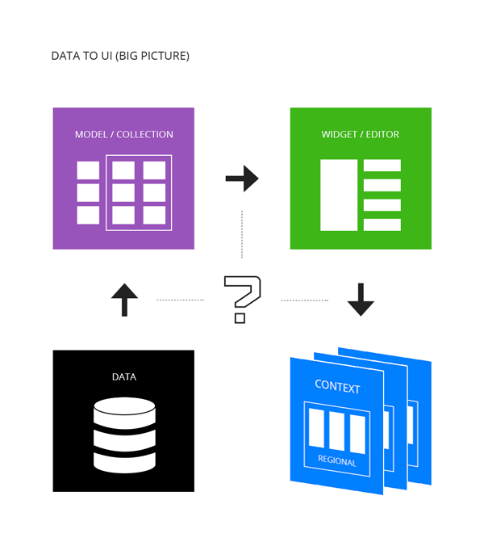
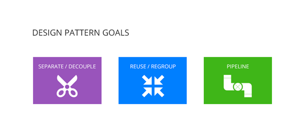

###Mental preparation
> Technique means nothing if people have no purposes in their mind. To prepare mentally to adapt something is to synchronize the mind around the subject domain so that insights can be developed while applying the technique. The ultimate goal is always to understand the subject (in our case the problem) better.

> Make sure to ask enough questions, so you can quickly locate the core problem that a given technique is trying to solve efficiently. Then go apply the technique and try making changes. Soon enough, you will start to see things like the solution creator, and concepts and ideas start to come out naturally. True understanding is almost always developed this way.

Frameworks are ways of doing things, they are biased. If you don't feel like doing things *their* way, identify the core problems and solve them in a sequence that fits you, and that process will eventually turn into *your* own framework.

###The Web app problem
Before start, you need to understand what is a *GUI application*, here is a brief diagram (casted upon the web realm):

</img>

The client and server sides are different in purpose fundamentally. Thus, they should be designed and implemented differently. **Do NOT mix them**. Shutting this door will preserve a significant amount of coding/maintenance energy for the application developer(s). The best software development practice encourages separation and delaying of implementation of related components so that each part can vary independently later. And to the author, abstraction should happen after categorization (or say, classification). This is why we are advising the developers *NOT* to make an overly encapsulated framework with tools that try to bridge the gaps. Trying to control everything using central planning is a human flaw, there is no silver-bullet for trying to solve web application building in 1 piece. It will always 3 parties in the software application world.

As an engineer, the job is to find insights and solve problems between the 3 parties efficiently (profitably if you must insist...) so that the software/application serving the above system comes out correctly. This is hard. Specifically, You need to resolve 2 kinds of problem different in nature: *Interaction* and *Data Flow* in order to produce an application.
A successful one requires both parts to employ careful design and feasible technique. We illustrate the *Interaction* problem's technical side here, since the framework is more about supporting a good design with cleaner implementation:

</img>

As you can see from the above diagram, there are 3 problems here to address when implementing a UI/UX side for an application:
1. Data <i class="fa fa-arrows-h"></i> Model/Collection [snapshot]
2. Model/Collection [snapshot] <i class="fa fa-arrows-h"></i> View (UI)
3. View <i class="fa fa-arrows-h"></i> Layout/Page + Transitions (UX)

Failing to address any of the 3 parts above will cost the project a significant amount of refractory time. Do *NOT* skip or trying to merge them into one big abstraction. Conquer each one with a consistent API style (like parameters and naming conventions) then combine the result. A complete system is never a destination, it is only a state of being or appearance. In other words, anytime you want your solution appear to be *a complete one*, focus on identifying the key problems and then solve them. Do *NOT* set your goal to be *a complete system* when start.

So, how do we form our solution?

###Moving away from ExtJS
We have been developing in ExtJS4 for 2+ years, starting form the last version of 4.0.x which is the promising 4.0.7. As our knowledge base expands, we felt that it is time to form our own blueprint of a modern data heavy web application to shorten the development cycles. Here are some of the main reasons:

1. Although it is relatively fast to develop prototypes using an all-in-one framework like ExtJS, it is hard to maintain the code while keeping up with the changes required by the users and those that come from Sencha. The widgets are bound too tightly with the framework.
2. Loading, DOM interfacing, Widget and Application containers are all provided with a biased opinion, which always leads to fighting with the framework here and there or messing around with the life-cycles defined when trying to implement application specific user requirements. 
3. Performance issues. There are often a massive amount of unnecessary DOM elements lurking in the client browser. We have very limited control over the life-cycles nor the HTML template structure of the components. Making widgets as Classes and loading like Java is really a bad idea for Javascript.
4. Theming difficulties. It is hard to theme an ExtJS application correctly given the extensively nested component structure and the lack of SASS/Compass adaptation among developers.
5. Payed solution. The commercial version of ExtJS and the tools (IDE) are expensive. This also makes the community size smaller than its full/free open source counterparts, making it difficult to find solutions from resources other than the documentation.

If the above listing can not convince you, try to compare the ExtJS solutions to the web application building process with ours: (Strict MVC vs View centric)

0. Classes vs 4 types of general view;
1. Containers vs General in-template regions;
2. Layouts vs Dynamic grid system;
3. Thick data layer vs A single remote() API;
4. Single Viewport vs Switchable Contexts;
5. Controllers vs Generic events and view actions;
6. XTemplate vs Handlebars;

The one thing that ExtJS could not get right and still is getting wrong is that it tries to use Javascript like JAVA and dominating HTML/CSS manipulation. It casts the developers out to a changed problem domain where basic problems are taken cared of in a complicated/overkilled way so that the programs can be written like *piles of configure files*. 

The *Class* system confuses developers coding in Javascript's function scope, the heavy *Layout* system kills what HTML/CSS is designed for and good at, the thick *Data* layer tries to isolate data snapshot from their in-separable views and the *Controllers* pulls developers out into another place to define routines just to have the listeners wired back again into the views. All of these ignores the fact that the core of a web application is at HTML(client-side) and the data(server side), not the glue and state snapshots. (Well, maybe in 5.0 they can fix it, we have high hope on this...)

Whatever you do, *Do NOT* stack up abstraction layers over layers so further programs can be written like configuration files. It will be slow to run, even harder to change and incur a very steep learning curve for new comers...

We choose to move away from this heavy framework to avoid its complexity and downside and to have more control over the component life-cycles, interactions and application container separately. An equally powerful yet still lightweight solution combining the best practices in the field is thus made. 

###Essence of Design Patterns
As *Design Patterns* dictates, we need to code in a way to:

</img>

###Rules of Thumb
####General
* Keep things simple, especially the simple ones.
* Categorization before abstraction.
* Separate, Reuse and Pipeline.
* Cleaner method signature. Options as a single object parameter.
* Events for collaborations and process control instead of APIs. Promises for asynchronous operations instead of callbacks.

Start with user requirements/stories and focus on serving the customers' need. Use the 80/20 rule to pick out important features/functionalities and implement them first. Gradually refine code and documentation later. Remember to write down **why** before **how** in the code comments. !FOCUS!

####GUI
* Concision - exact but nothing more
* Expressiveness - allow useful possibilities be deducted
* Ease - low mnemonic load on commands, control sequence
* Transparency - low mnemonic load in user's mind for keeping track of states/layers of task at hand
* Script-ability - batch-able, automate-able

####Product design
(Goal-Driven)...